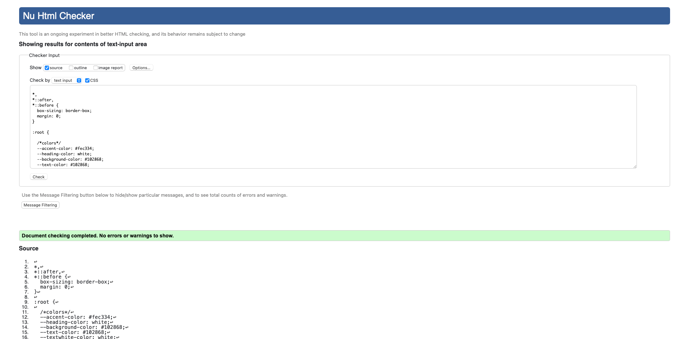
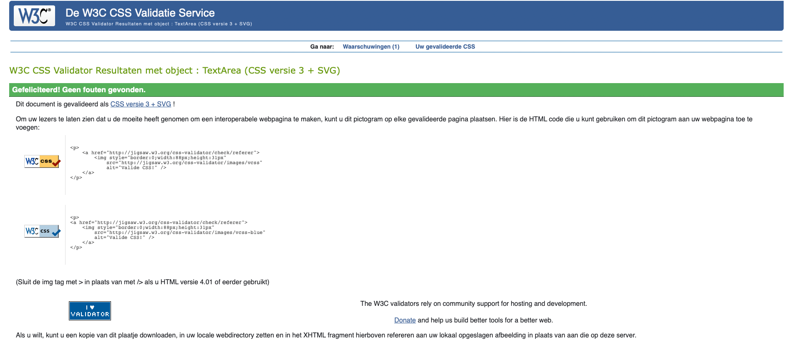
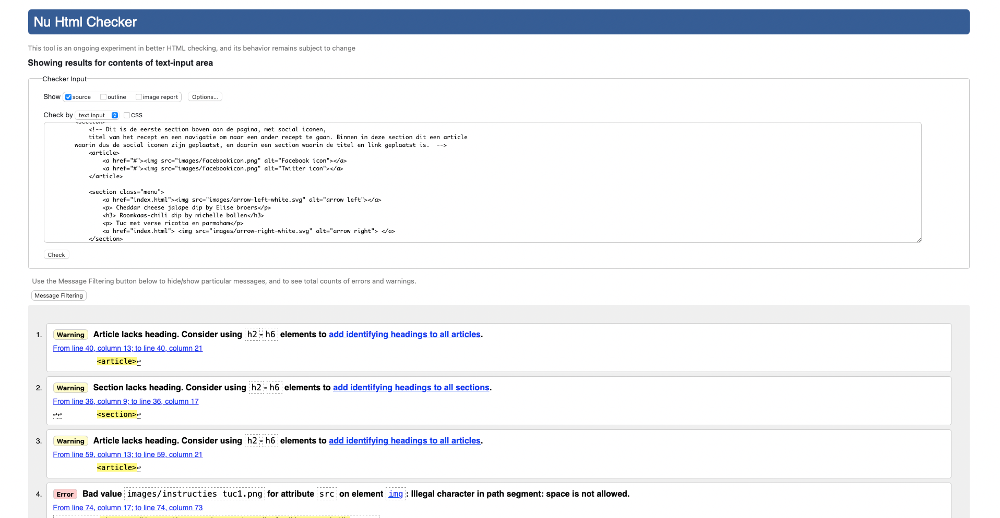
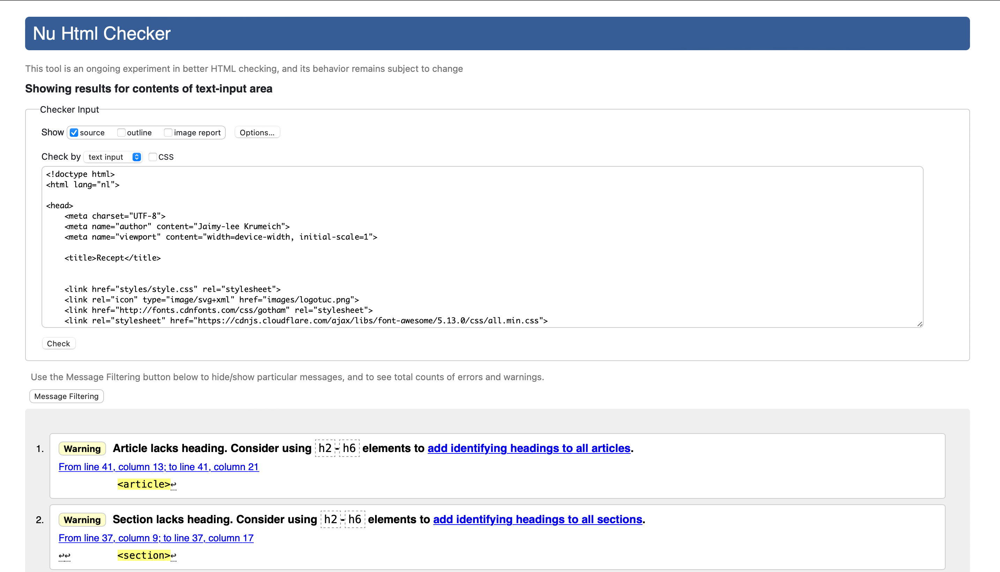
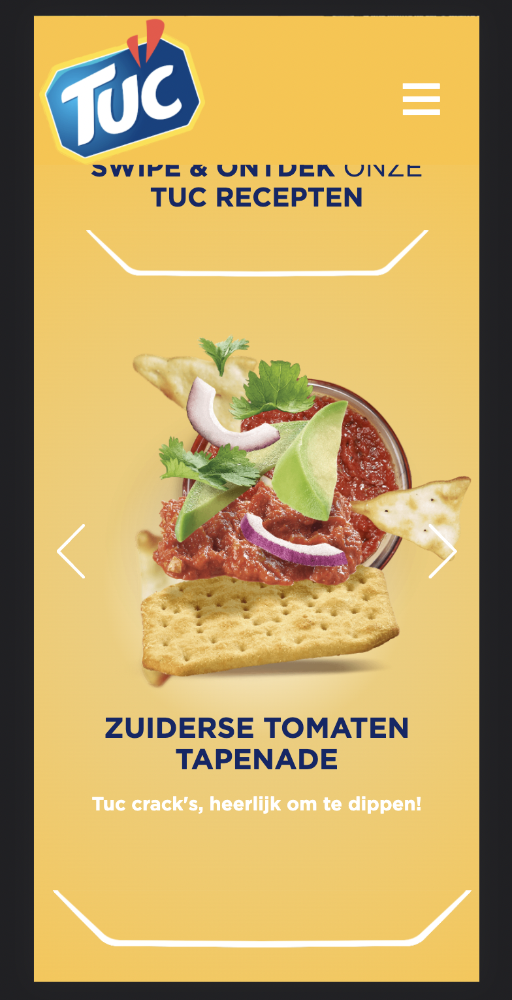

# Procesverslag
Markdown is een simpele manier om HTML te schrijven.  
Markdown cheat cheet: [Hulp bij het schrijven van Markdown](https://github.com/adam-p/markdown-here/wiki/Markdown-Cheatsheet).

Nb. De standaardstructuur en de spartaanse opmaak van de README.md zijn helemaal prima. Het gaat om de inhoud van je procesverslag. Besteedt de tijd voor pracht en praal aan je website.

Nb. Door *open* toe te voegen aan een *details* element kun je deze standaard open zetten. Fijn om dat steeds voor de relevante stuk(ken) te doen.

## Jij

uitwerken voor kick-off werkgroep

### Auteur:
Jaimy-lee Krumeich

#### Je startniveau:
Rood

#### Je focus:
Ik denk beide.. Twijfel nog. Ik wil van beide zo ver mogelijk komen. Het liefst wel helemaal responsive!
 

## Je website

uitwerken voor kick-off werkgroep

### Je opdracht:
https://www.tuc.nl

#### Screenshot(s) van de eerste pagina (small screen): 
hier de naam van de pagina  

#### Screenshot(s) van de tweede pagina (small screen):
hier de naam van de pagina  

 

## Breakdownschets (week 1)

uitwerken na afloop 2e werkgroep

### de hele pagina: 

<!-- ### dynamisch deel (bijv menu): 

### wellicht nog een dynamisch deel (bijv filter): 
 -->

## Voortgang 1 (week 2)

uitwerken voor 1e voortgang

### Stand van zaken
Het opzetten van de HTML ging me goed af, ik had al redelijk snel css toegevoegd, waardoor ik later wat vast liep met het maken van de hamburger menu. Verder was het voormij even puzzelen met de headings, omdat op de officele website van Tuc het ook erg verwarrend is. Er is weinig onderscheid tussen de headings. 

### Verslag van meeting

- Ik moet meer em gebruiken inplaats van pixels.
- In mijn eerste section heb ik 3 keer gebruik gemaakt van een H1. Dit moet ik aanpassen
- Proberen om wat articles in mijn css samen te voegen. 
- Voorderest kreeg ik te horen dat ik redelijk goed op weg was. 

## Voortgang 2 (week 3)

uitwerken voor 2e voortgang

### Stand van zaken
Ik wilde een aantal elementen laten werken door middel van JS. Javascript is niet echt een sterk punt van mij, dus ik vond het lastig. Ik was wel al op de goede weg, maar tijdens het voortgang gesprek kwamen we er gezamelijk ook niet uit. Ik wilde dat wanneer je op het share icoontje klikt er media iconen werden toegevoegd. Ik begon bij 1 icon, namelijk het Facebook icoontje. Dit is gelukt, maar na veel te geprobeerd te hebben krijg ik het nog steeds niet voor elkaar dat dat in iedere article gebeurt. 

Samen met Bo en Carolin hebben we al dingen aangepast in JS, zoals: querySelectorAll toevoegen ect.
Als tip kreeg ik om wat meer classes te gebruiken, om zo het mijzelf ook makkelijker te maken in de JS.

Verder heb ik van mijn eerste pagina ongeveer 85% af. De elementen die ik nu nog mis dat zijn meer de (micro)interacties en de footer. De footer stelde ik eigenlijk steeds uit, omdat ik lastigere elementen eerst wilde laten werken. 

Hamburger menu heb ik na veel uur eindelijk voor elkaar gekregen, deels doormiddel van de codepen uitleg van Sanne, maar, omdat ik het net anders wilde heb ik de codes wel moeten ontcijferen tot ik het kon toe passen. 

Ik ga kijken of ik het nog in me eentje voor elkaar kan krijgen in de aankomende weken. 

### Agenda voor meeting
Er waren geen medestudenten aanwezig tijdens het voortgang gesprek.

### Verslag 

- Nog verder gaan met JS
- Beginnen aan de tweede pagina
- Classes toevoegen

## Toegankelijkheidstest (week 4)

uitwerken na test in 8e voortgang

### Bevindingen
Screenreader - Sommige a tags staan klein beetje naast de afbeelding, klikken kan wel doormiddel van de enter. 
Bril vlekken > Redelijk 
Bril zwarte vlek > Ik zag alleen de randen van de website.
Bril andere vlekken > Kon nog goed door de website navigeren

#### Screenreader
Toen ik de screenreader geactiveerd had op mijn macbook kon ik kijken of de structuur van de website klopt en of mijn alt teksten relevant waren. Dit was gelukkig het geval. Ik had de focus state uitgewerkt, waardoor het goed te volgen was. Verder moet ik nog wel enkele margin opmaak weghalen, want deze verschuiven de boel.

#### Bril wazig
Ik kon door deze bril prima heen kijken en kon goed door mijn website navigeren. 

#### Bril vlekken 
Met deze bril werd het iets lastiger om de website goed te kunnen zien, wel kon ik goed door mijn website heen navigeren. Oplossing is een screenreader die navigeert door je website heen. 

#### Bril met zwarte rondjes
Met deze bril kon ik weinig zien, ik zag alleen de buitenste randen. Wel kon ik nog navigeren. Ik denk dat ik 85% van het scherm niet meer zag, ik zou hierdoor dus gebruik moeten maken van een screenreader.

#### Concentratie probleem
Dit was wat lastiger, ik hield mij vooral bezig met de ballon en om deze niet te laten vallen. Hierdoor kon ik niet goed door mijn website navigeren. In dit geval zou ik dus ook het beste een screenreader kunnen gebruiken. 

Ook heb ik hulp gekregen van Robert met een punt waar ik vast liep, namelijk de share - media iconen.

## Voortgang 3 (week 4)

uitwerken voor 3e voortgang

### Stand van zaken
De eerste en tweedepagina zijn zo goed als af, nu werken aan de laatste details.
De laatste puntjes op de i zetten gaat wat meer met moeite. Ik ben momenteel wat meer Javascript aan het toevoegen. De website is naar mij genoeg goed responsive en nu ga ik verder met de plane, dus het opmaken van de buttons ect. Doordat ik de focus states heb opgemaakt, kun je makkelijker met de Tab door de pagina heen. Verder heb ik ook de hover state volledig uitgewerkt met icons. 

Ik heb mijn Css en HTML door de validator gehaald om te kijken of deze fouten bevatten.
In mijn CSS had ik geen warnings of errors. In mijn Html pagina's enkele warnings over dat sommige articles of section geen heading bevatten en een error, omdat ik in de naam van sommige images een spattie gebruikt heb. Dit moet ik nog aanpassen. 

## Eindgesprek (week 5)

uitwerken voor eindgesprek

### Stand van zaken
Na mijn laatste voortgang gesprek heb ik aan het volgende gewerkt:
- Elementen toevoegen voor de fun, zoals een zoekbalk en de toon alles button gemaakt dat de text weer aangepast wordt naar toon minder
- image aangepast met behulp van object-fit:cover
- Footer afgemaakt 
- Vergeten bronnen toegevoegd
- list-style:none 
- Nog wat keyframes toegevoegd om het nog speelser te maken
- Aanpassingen in mediarequerys

- Proberen verder te komen met de slider
Helaas is het niet meer binnen de tijd gelukt om de slider goed te krijgen. Ik heb hulp gevraagd, en er werd mij verteld dat ik moet kijken om te werken met if and else. Toch is het niet gelukt en had ik niet meer tijd om verdere hulp te krijgen (stress door HCI tentamen tussen door ;( )). Veel geprobeerd door research van het internet, maar doordat ik er te lang naar bleef kijken zag ik het niet meer. Volgende keer beter!

Tijdens dit vak heb ik weer ontzettend veel nieuwe dingen geleerd, en dan vooral het animatie en grid gedeelte, daar heb ik veel uit kunnen halen, en door de duidelijke lessen het eindelijk goed kunnen begrijpen!

Ook heb ik mijn codes weer door de validator gehaald en dit waren de resultaten:

### Screenshot(s)

Resultaten validator html:

Resultaten validator css:

Vast gelopen bij dit:

## Bronnenlijst

continu bijhouden terwijl je werkt

Nb. Wees specifiek ('css-tricks' als bron is bijv. niet specifiek genoeg).

1. https://stackoverflow.com/questions/18920542/draw-an-x-in-css 
2. https://codepen.io/jaimkrumeich/pen/ExwWPpL?editors=1100
3. https://cssgradient.io 
4. https://stackoverflow.com/questions/18920542/draw-an-x-in-css
5. Robert Spier: https://codepen.io/robertspier/pen/PoJzRYg?editors=1011
6. https://codepen.io/shooft/pen/abwLwRO
7. https://extract.pics/
8. Humty oefening (voor de hamburger menu)

